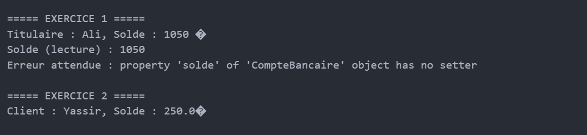

# TP : Encapsulation et Composition en Python

## Exercice 1 — Encapsulation d’un compte bancaire
Classe `CompteBancaire` :
- `_titulaire` (protégé)
- `__solde` (privé)
- `deposer()` et `retirer()`
- propriété `solde` (lecture seule)

## Exercice 2 — Composition Client / Compte
Classe `CompteBancaire2` et classe `Client` :
- le client possède un compte
- opérations : dépôt, retrait, affichage

## Exécution du TP

